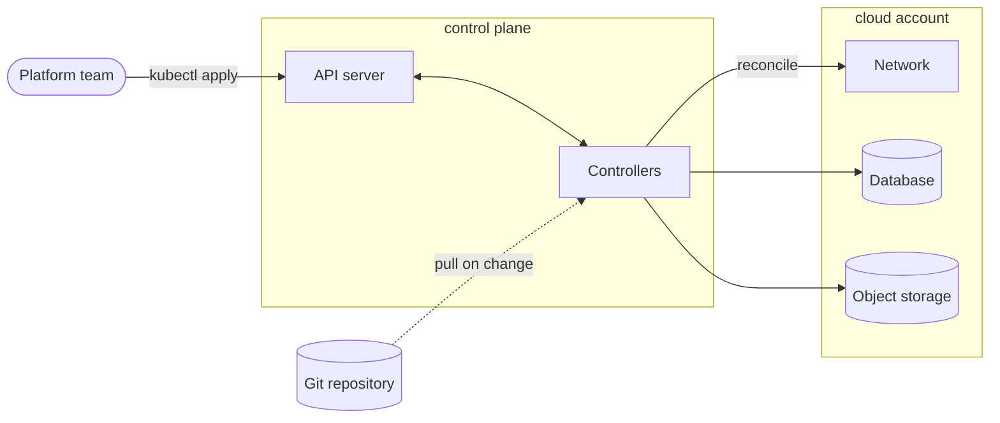

# Architecture: a control plane and what it manages

<!--
Template: architecture. Copy the mermaid block into a slide with
`layout: diagram`.

- A subgraph is a boundary that matters: a cluster, an account, a network,
  a team. Name it in lowercase, like a directory. No subgraph for decoration.
- Inside a boundary set `direction TB`; the whole picture flows LR.
- Components are plain panes. Mark one :::focus (the thing the slide
  explains), data at rest :::store, and anything outside your control :::ext.
- Edge labels say what crosses the line (reconcile, kubectl apply). Label one
  edge of a fan-out, not every edge: parallel labels overlap.
- Three boundaries and about ten components is the ceiling for one slide.
  Zoom in on the next slide instead of adding more.
-->
