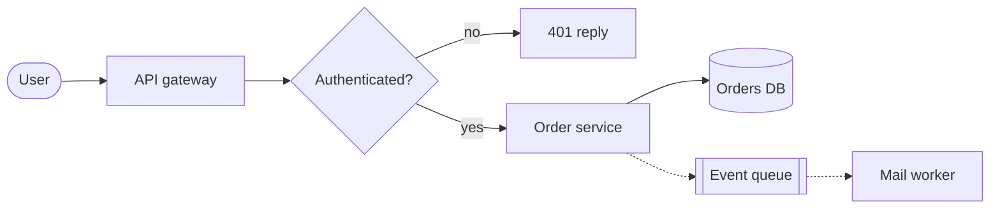

# Flowchart: how a request is handled

<!--
Template: flowchart. Copy the mermaid block into a slide with `layout: diagram`.

- Direction: LR on slides (16:9). Use TB only for short, deep chains.
- Shapes carry structure: [process], {decision}, ([start or end]),
  [(database)], [[queue or buffer]]. Do not invent others.
- Edges: solid for the normal path, dotted (-.->) for asynchronous or
  eventual, thick (==>) for the one path the slide is about.
- Labels on edges answer a question (yes / no / on failure), two words at most.
- Classes carry meaning, nothing else: :::focus for the subject, :::ok healthy,
  :::warn degraded or pending, :::fail failure or forbidden, :::ext outside
  the system, :::store data at rest. Everything else stays plain.
- Keep it to about 8 nodes. More than that is two slides.
-->
