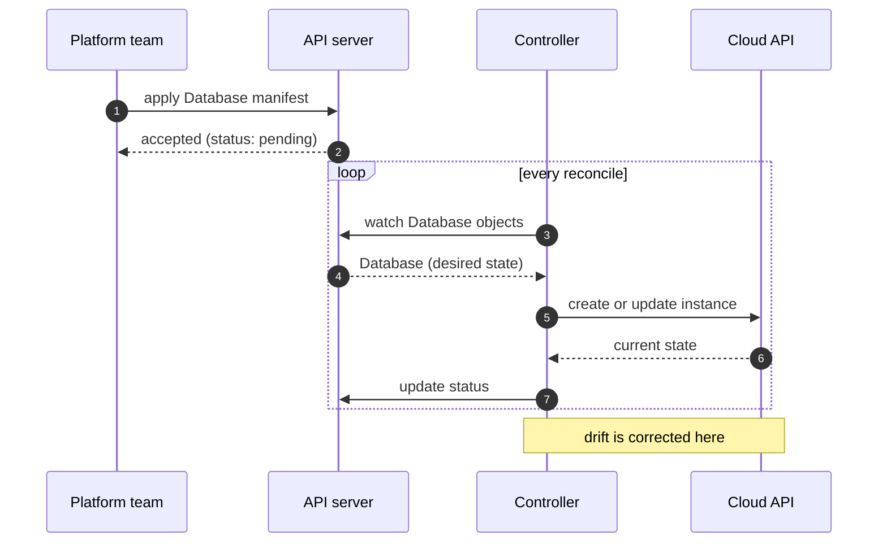

# Sequence: creating a resource through the control plane

<!--
Template: sequence. Copy the mermaid block into a slide with `layout: diagram`.

- Participants left to right in the order a request travels. Short aliases
  (Dev, API, Ctrl) keep the lifelines close together.
- Solid arrows are requests, dashed arrows are replies (the dashed form
  cannot be written inside this note; see the diagram above).
- `loop`, `alt` and `opt` blocks show control flow; use at most one per slide.
- One note per slide, for the single point the picture exists to make.
- `autonumber` when the talk refers to steps by number; leave it out otherwise.
- Eight messages is a comfortable maximum.
-->
