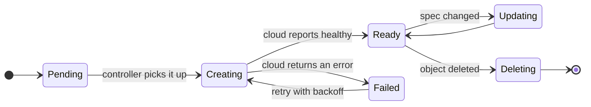

# State: the lifecycle of a managed resource

<!--
Template: state. Copy the mermaid block into a slide with `layout: diagram`.

- States are nouns or adjectives (Pending, Ready); transitions are the event
  that causes them, written after the colon.
- `direction LR` on slides. Start and end with [*].
- Keep every transition that can actually happen and nothing hypothetical.
  If the picture needs more than seven states, split by phase.
-->
