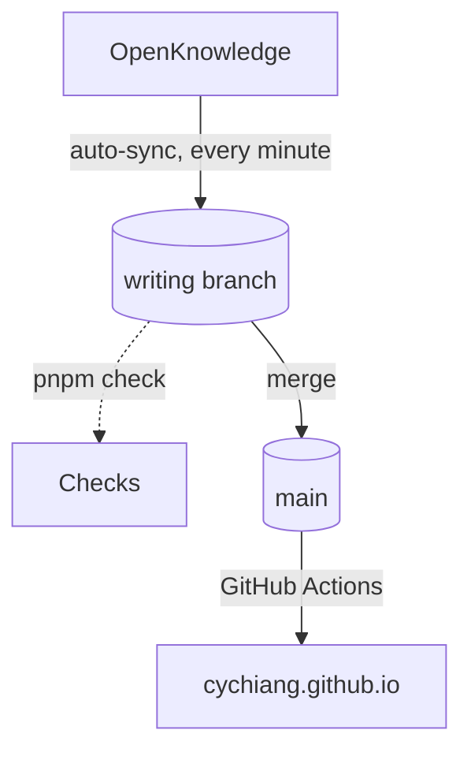

This site has two kinds of content: slide decks under `decks/`, and notes
like this one under `posts/`. Both are Markdown files in one Git
repository, and both reach the homepage the same way.

## The loop



Writing happens in OpenKnowledge, which opens this repository as its
project with the `writing` branch checked out. Every edit is committed and
pushed on its own. Nothing is published yet: the `writing` branch only runs
the checks, so a broken frontmatter or a dead link shows up as a red mark
and not as a broken page.

Publishing is one deliberate step: merge `writing` into `main`. The
deploy workflow builds the homepage and every deck, and the site is live a
minute or two later.

## What a post needs

```yaml
---
title: How this site is published
description: One sentence, shown on the homepage.
date: 2026-10-10
tags: [meta]
draft: false
---
```

The file name is the address: `posts/2026-how-this-site-is-published.md`
becomes `/posts/2026-how-this-site-is-published/`. A post with
`draft: true` stays out of the published site, which is how half-written
thoughts can live in the same place as finished ones.
